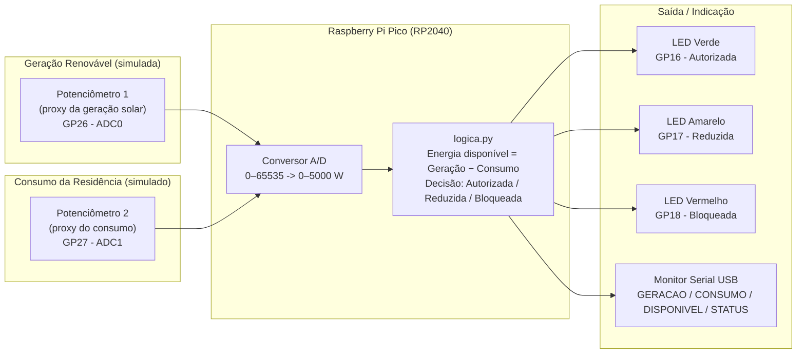

# ChargeGrid Intelligence — Controle Inteligente de Sessão de Recarga

**Disciplina:** Soluções em Energias Renováveis
**Sprint:** 3 — Prototipagem Funcional e Integração
**Projeto (contexto geral, Challenge FIAP × GoodWe):** ChargeGrid Intelligence

## Equipe

| Nome | RM |
|---|---|
| Rafael Laprega Gontijo Magalhães | 561975 |
| Gustavo Torres de Oliveira | 572952 |
| Lucas Furquim Lima | 568690 |
| Diogo Chiaradia Santos | 570246 |

---

## 1. Objetivo do protótipo

Nas Sprints 1 e 2 o grupo propôs, como parte da solução ChargeGrid Intelligence, um
controlador capaz de decidir automaticamente se uma sessão de recarga de veículo
elétrico pode ser **autorizada**, **reduzida** ou **bloqueada**, com base no saldo entre a
energia gerada por fontes renováveis (solar, no caso) e o consumo simultâneo da
residência ou posto. Esta sprint entrega esse controlador como um **protótipo funcional
simulado**, rodando em hardware real de baixo custo (Raspberry Pi Pico) via simulação no
Wokwi, evidenciando a integração entre geração renovável, automação embarcada e a lógica
de decisão da sessão de recarga.

A regra central, definida já na Sprint 1 e mantida sem alteração:

```
Energia disponível = Geração solar (W) − Consumo da residência (W)
```

| Energia disponível | Estado da recarga | LED |
|---|---|---|
| ≥ 2.000 W | Autorizada | Verde |
| entre 0 e 2.000 W | Reduzida | Amarelo |
| ≤ 0 W | Bloqueada | Vermelho |

O limiar de 2.000 W é uma escolha do grupo (o enunciado original não define um valor
exato) documentada em código, compatível com os três exemplos de referência:

- Geração 4000 W, Consumo 1500 W → 2500 W disponível → **Autorizada**
- Geração 1800 W, Consumo 1500 W → 300 W disponível → **Reduzida**
- Geração 1000 W, Consumo 1800 W → −800 W disponível → **Bloqueada**

---

## 2. Esquema de integração dos componentes

### 2.1 Diagrama de blocos



### 2.2 Circuito simulado (Wokwi)

O circuito está descrito em [`diagram.json`](diagram.json) e reproduz, em hardware
simulado, exatamente os blocos do diagrama acima:

- **1x Raspberry Pi Pico** — unidade de processamento (RP2040, dual-core ARM Cortex-M0+).
- **2x Potenciômetros**, ligados às entradas analógicas GP26 e GP27, fazendo o papel dos
  sensores de geração solar e de consumo da residência (proxy analógico: girar o
  potenciômetro simula a variação natural de geração ao longo do dia ou de consumo
  doméstico).
- **3x LEDs (verde/amarelo/vermelho)** com resistores de 220 Ω, ligados às saídas
  digitais GP16/GP17/GP18 — indicação visual imediata do estado da sessão de recarga.
- **Monitor Serial USB** — canal de saída de dados textuais, usado tanto para
  depuração quanto como "log" legível da decisão tomada a cada ciclo.

Para gravar o vídeo com os três cenários exatos do enunciado (sem depender de girar os
potenciômetros manualmente), o grupo usa [`demo_cenarios.py`](demo_cenarios.py), que
injeta os três pares (geração, consumo) de referência diretamente na mesma lógica de
decisão.

---

## 3. Justificativa técnica das escolhas

**Raspberry Pi Pico / MicroPython.** Escolhido por ser um microcontrolador de baixo
custo, baixo consumo energético e com suporte nativo a MicroPython, o que reduz a
barreira de prototipagem e é coerente com o próprio tema da disciplina: soluções de
energia renovável se beneficiam de controladores eficientes energeticamente, e não de
computadores de propósito geral rodando o tempo todo.

**Potenciômetros como proxy dos sensores reais.** Em um sistema real, a geração seria
lida de um inversor solar (via protocolo como Modbus ou OCPP, conforme proposto nas
Sprints 1/2) e o consumo de um medidor de energia residencial. Como o protótipo desta
sprint precisa ser demonstrável em simulação, os potenciômetros fazem o papel desses
sensores analógicos, permitindo variar os valores de geração e consumo em tempo real
durante a demonstração sem exigir hardware de medição real.

**LEDs como atuador/indicador.** Um sistema de automação energética precisa comunicar
seu estado de forma imediata e não ambígua a quem está usando o carregador. Os três LEDs
coloridos (verde/amarelo/vermelho) replicam a semântica universal de sinalização
(livre/atenção/bloqueado), o que também poderia ser estendido, em uma versão de
produção, para acionar um relé real que efetivamente limita ou corta a corrente de
recarga.

**Limiar de 2.000 W definido pelo grupo.** Serve como aproximação da potência nominal de
um carregador residencial de recarga "plena". Em uma implantação real, esse valor seria
configurável por instalação (depende da potência do carregador contratado).

**Complemento de dois para valores negativos.** A energia disponível pode ser negativa
(consumo maior que a geração). Representá-la em binário/hexadecimal usando complemento
de dois de 16 bits — e não como "sinal + módulo" — é a forma como o próprio hardware do
RP2040 representa inteiros com sinal, conectando a decisão de automação diretamente ao
conteúdo de representação numérica visto na disciplina de Arquitetura de Computadores.

---

## 4. Resultados e dados funcionais

Execução real de [`demo_cenarios.py`](demo_cenarios.py) no interpretador MicroPython
(testado tanto no MicroPython 1.22.1 real quanto no simulador Wokwi), reproduzindo os
três cenários de referência ponta a ponta:

```
=== ChargeGrid Intelligence - Controle Inteligente de Sessao de Recarga ===
=== Demonstracao dos 3 cenarios oficiais do enunciado ===

--- Situacao 1 ---
GERACAO: 4000 W CONSUMO: 1500 W DISPONIVEL: 2500 W  STATUS: RECARGA AUTORIZADA
  Representacao de DISPONIVEL (2500 W) -> Decimal: 2500  Binario: 0000100111000100  Hexadecimal: 0x09C4
  LED aceso: verde

--- Situacao 2 ---
GERACAO: 1800 W CONSUMO: 1500 W DISPONIVEL: 300 W  STATUS: RECARGA REDUZIDA
  Representacao de DISPONIVEL (300 W) -> Decimal: 300  Binario: 0000000100101100  Hexadecimal: 0x012C
  LED aceso: amarelo

--- Situacao 3 ---
GERACAO: 1000 W CONSUMO: 1800 W DISPONIVEL: -800 W  STATUS: RECARGA BLOQUEADA
  Representacao de DISPONIVEL (-800 W) -> Decimal: -800  Binario: 1111110011100000  Hexadecimal: 0xFCE0
  LED aceso: vermelho
```

Cobertura automatizada: 8 testes unitários em [`test_logica.py`](test_logica.py) —
incluindo exatamente os três cenários oficiais, os casos de fronteira (0 W e 2000 W
exatos) e a representação binária/hexadecimal — todos passando (`pytest -v`).

> No vídeo da entrega, este mesmo resultado é demonstrado ao vivo no Monitor Serial do
> Wokwi, junto com os LEDs físicos acendendo em tempo real para cada cenário.

---

## 5. Conexão com os conteúdos da disciplina

- **Automação inteligente:** o controlador toma a decisão de autorizar, reduzir ou
  bloquear a recarga automaticamente, sem intervenção humana, reagindo em tempo real à
  variação da geração e do consumo — o núcleo do conceito de automação aplicado a energia.
- **Eficiência energética:** ao reduzir ou bloquear a recarga quando a geração renovável
  não é suficiente, o sistema evita que o veículo puxe energia da rede elétrica
  convencional (ou sobrecarregue a instalação), priorizando o uso da energia solar já
  gerada localmente.
- **Sustentabilidade:** o protótipo materializa, em código executável, a proposta das
  Sprints 1 e 2 de acoplar a recarga de veículos elétricos à disponibilidade real de
  energia limpa, em vez de tratá-la como uma carga fixa e independente da fonte de
  energia.
- **Integração hardware-software:** a solução conecta sensores (entrada analógica),
  processamento (lógica de decisão em `logica.py`) e atuadores (LEDs/saída serial),
  mostrando de ponta a ponta como um sistema embarcado de baixo custo pode operar como
  peça de uma rede inteligente de energia (smart grid) em escala residencial.

---

## 6. Estrutura do repositório

```
solucoes-energias-renovaveis-sprint3/
├── README.md            # este documento (título, equipe, integração, justificativa, resultados)
├── logica.py            # lógica pura de decisão (testável em Python comum, sem hardware)
├── main.py              # versão interativa: 2 potenciômetros (geração/consumo) + LEDs
├── demo_cenarios.py      # versão com os 3 cenários fixos do enunciado (recomendada p/ vídeo)
├── diagram.json          # circuito Wokwi (Pico + 3 LEDs + 2 potenciômetros)
├── test_logica.py         # 8 testes automatizados (pytest)
└── ENTREGA.txt            # nomes, RMs, link do vídeo e do repositório (o único arquivo enviado no portal)
```

## 7. Como rodar

**No Wokwi:** crie um novo projeto Raspberry Pi Pico, cole `diagram.json` como o
circuito, adicione `logica.py` e `demo_cenarios.py` (ou `main.py`) como arquivos do
projeto, e rode. O Monitor Serial mostra a saída formatada.

**Testes locais (sem hardware):**
```bash
pip install pytest
pytest test_logica.py -v
```
